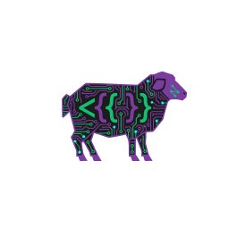

<p align="center">
  
</p>

<h1 align="center">ShepLang</h1>

<p align="center">
  <strong>The first programming language with AI as a built-in verb.</strong>
</p>

[](https://opensource.org/licenses/MIT)
[](https://www.npmjs.com/package/@goldensheepai/shep-cli)
[](https://marketplace.visualstudio.com/items?itemName=GoldenSheepAI.sheplang)
[](https://marketplace.windsurf.com/extension/goldensheepai/sheplang/reviews)
[](https://github.com/Radix-Obsidian/ShepStack)
[](https://github.com/Radix-Obsidian/ShepStack/releases)

---

## What is ShepLang?

ShepLang is an **AI-native programming language** for describing software products. It compiles to Python, TypeScript, and SQL.

```shep
app "SupportTickets"

data Ticket {
  title: text (required)
  message: text
  sentiment: ai("classify as positive, neutral, negative")
}

action EscalateTicket {
  if ai(message, "sounds frustrated") {
    set status = escalated
    alert on-call
  }
}
```

**AI is a language primitive** — not an import, not a library.

---

## Quick Start

```bash
# Install
npm install -g @goldensheepai/shep-cli

# Create new project
shep new my-app
cd my-app

# Or let AI write your program
shep draft "A task manager with priorities"

# Compile to Python + TypeScript + SQL
shep compile --input app.shep --output generated
```

---

## Language Constructs

| Construct | Purpose | Example |
|-----------|---------|---------|
| `app` | Program declaration | `app "MyProduct"` |
| `data` | Data models | `data User { email: text }` |
| `view` | UI components | `view UserList { show: [email] }` |
| `action` | Business logic | `action CreateUser { save User }` |
| `task` | Background jobs | `task SendEmail { on: user.created }` |
| `ai()` | AI primitive | `ai("classify sentiment")` |

---

## Compilation Targets

| Target | Output |
|--------|--------|
| **ShepThon** | Python (FastAPI + Pydantic) |
| **ShepLang-JS** | TypeScript (React + interfaces) |
| **ShepSQL** | PostgreSQL schema |

Plus auto-generated: JWT auth, admin dashboard, CRUD endpoints.

---

## Install

### CLI

```bash
npm install -g @goldensheepai/shep-cli
```

### VS Code Extension

Search "ShepLang" in VS Code, Windsurf, or Cursor extensions.

---

## Documentation

📁 **All documentation is in [`shepstack/`](./shepstack/)**

- [Quick Start Guide](shepstack/docs/guides/quickstart.md)
- [ShepLang by Example](shepstack/docs/guides/sheplang-by-example.md)
- [Language Specification](shepstack/docs/spec/sheplang-spec.md)
- [Philosophy](shepstack/docs/spec/shep-philosophy.md)
- [Roadmap](shepstack/docs/roadmap/00-high-level.md)

---

## Repository Structure

```
/
├── shepstack/           # Main monorepo
│   ├── packages/        # npm packages
│   │   ├── shep-cli/    # CLI (shep compile, shep draft)
│   │   ├── shep-core/   # Parser, verifier, types
│   │   ├── shep-lsp/    # Language Server Protocol
│   │   ├── sheplang/    # TypeScript codegen
│   │   └── shepthon/    # Python codegen
│   ├── editors/         # IDE extensions
│   │   └── vscode-extension/
│   ├── docs/            # Documentation
│   └── examples/        # Example programs
├── agent-builder        # AI persona for ShepLang development
└── rules                # Project guidelines
```

---

## Contributing

We welcome contributions! See [CONTRIBUTING.md](shepstack/CONTRIBUTING.md).

---

## License

MIT © [Golden Sheep AI](https://github.com/Radix-Obsidian)

---

**AI writes the code. You own the vision.** 🐑
